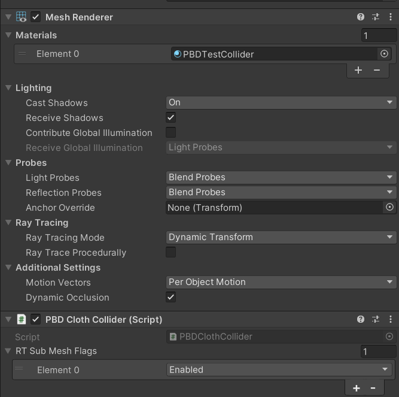

# Unity Built-In Ray Tracing

硬件光追(HWRT)，不管用不用的上，学还是得学的，毕竟现在出个SoC只要带了光追单元都要吹上一吹(甭管好不好用)。

我们这里只考虑Unity中硬件光追的使用，并且是在builtin管线下的使用。因为硬件光追只与所用的Unity版本以及硬件(更准确的是显卡、系统、驱动以及图形API)有关，与所用的管线无关：比如早些年的版本是不支持A卡的，但是较新版本的unity是支持A卡硬件光追的。我们这里用的是Unity 2022.3.+(LTS)的版本：因为2023版还没有LTS版的，Unity6又太新了，里面bug还是有不少的，不便于学习。

> [!IMPORTANT]
>
> 在开始前，首先需要确认你的显卡是否支持Unity的硬件光追：先把项目所用的图形API更改为DX12，然后看`SystemInfo.supportsRayTracing`的值是否为`true`。当然，还有一种办法是查看所用的Unity版本对应的HDRP的文档：[Getting started with ray tracing | High Definition RP | 14.0.11](https://docs.unity3d.com/Packages/com.unity.render-pipelines.high-definition@14.0/manual/Ray-Tracing-Getting-Started.html#hardware-requirements) 里面就有支持的显卡型号。当然，如果你用的是A卡，则需要注意后文中会提到的关于A卡的硬件光追"Bug"。

项目里实现了基于硬件光追的以下功能：

- Unity的renderer的path tracer
- Instance的path tracer
- 基于PBD的布料模拟(用HWRT做碰撞检测)

> [!NOTE]
>
> 需要注意，现在Unity的API文档都是默认定位到Unity6下的文档，因此如果点开HWRT相关的API后想通过点击左上角的version来切换到2022.3.+版本的API，是会提示不支持的。因为2022.3.+版本中HWRT相关的API都是`UnityEngine.Experimental.Rendering`类下的，而Unity6里则被更改到了`UnityEngine.Rendering`里。


# 1. Renderer的光追

下文中涉及到DXR的内容，建议配合官方文档[[1]DirectX Raytracing (DXR) Functional Spec | DirectX-Specs](https://microsoft.github.io/DirectX-Specs/d3d/Raytracing.html)一起食用。

Unity的Renderer有很多子类，常见的Mesh Renderer, Skinned Mesh Renderer, Particle System Renderer, Trail Renderer等等，我们这里就只考虑最简单也是最常用的Mesh Renderer。

Renderer的硬件光追由以下内容组成：

- CPU端：
  - 用于执行RTS(Ray Tracing Shader)的Command Buffer的脚本
  - (可选)控制指定Mesh Renderer是否用于HWRT以及配置其RayTracingSubMeshFlags的脚本
- GPU端：
  - Ray Tracing Shader(.raytrace文件)：实现Ray Generation Shader, Miss Shader以及Callable Shader
  - Hit Groups Shader(.shader文件)：可以实现Closest Hit Shader, Any Hit Shader, Intersection Shader(注意，并不是都要实现，一般就实现Closest Hit Shader)

## 1.1 Ray Tracing Shader

在Ray Tracing Shader中，我们需要先定义`#pragma max_recursion_depth n`，这里的`n`是用户定义的`TraceRay()`最大的迭代深度，这个值必须得大于等于实际迭代的深度，否则可能会导致软件闪退。当然，这个`n`也是有[上限](https://microsoft.github.io/DirectX-Specs/d3d/Raytracing.html#ray-recursion-limit)的。

### 1.1.1 Ray Generation Shader

Ray Generation Shader通常有如下格式：

```
[shader("raygeneration")]
void YourRayGenShaderName()
{
	配置RayDesc
	//
	TraceRay(...)
	//
	处理输出的RayPayload
}
```

如果自行实现过软光追的话(特别是用CS实现过的话)，配置`RayDesc`这一步就非常容易理解了。假设我们要把光追的结果输出到一张$m\times n$大小的Render Texture上，并且在`Dispatch()`当前Ray Generation Shader时设置的threads grid为`(m, n, 1)`，那么可以利用`DispatchRaysIndex().xy`来获得当前的像素点的坐标(像素空间中的)，然后用`DispatchRaysDimensions().xy`来获得threads grid的**width**与**height**的大小(也就是`m`与`n`)，以此将像素坐标转到屏幕空间坐标。然后我们就可以利用当前相机的配置，将近裁剪面(或是远裁剪面)中当前顶点的屏幕空间坐标转为世界空间坐标(这一步只要做过(与深度相关的)屏幕空间后处理的话应该都知道怎么做，方法也很多)。从而我们有了当前像素点对应的射线的方向(世界空间中)。

[`RayDesc`](https://microsoft.github.io/DirectX-Specs/d3d/Raytracing.html#ray-description-structure)是由微软定义的结构，包含射线的

- 原点(`Origin`)：通常用相机的坐标。
- 方向(`Direction`)：我们上面计算的当前像素点对应的射线的方向。
- 起点距离(`TMin`)：在Ray Generation Shader中的初始射线，一般用相机的近裁剪面距离。在后续的通过反射或是折射生成的射线中，一般为0。
- 终点距离(`TMax`)：在Ray Generation Shader中的初始射线，一般用相机的远裁剪面距离。

> [!NOTE]
>
> 对给定的`RayDesc`，实际用于检测的是从`Origin + TMin * Direction`到`Origin + TMax * Direction`的直线段。

在执行`TraceRay()`前，我们还需要传入一个由用户自定义的结构`RayPayload`(并不一定要取这个名，不过后文为了方便我们都用这个结构体名)，用于在不同的shader之间传递必要的光追结果信息。

> [!NOTE]
>
> 需要注意的是，在Unity中我们定义自己的`RayPayload`结构时，并不需要按照[DXR官方文档中的语法规范](https://microsoft.github.io/DirectX-Specs/d3d/Raytracing.html#syntax)来定义，而只需要和定义一般的结构体一样来定义即可。


[`TraceRay()`](https://microsoft.github.io/DirectX-Specs/d3d/Raytracing.html#traceray)是将指定射线作用于[TraceRay control flow](https://microsoft.github.io/DirectX-Specs/d3d/Raytracing.html#traceray-control-flow)的方法：指定的射线会在RAS(RaytracingAccelerationStructure)中搜索是否有相交的三角形或是Instance Primitive，如果没有则返回通过Miss Shader后的结果，而如果有，则按照一定规则执行Hit Group中的那些Shader。需要注意的是，`TraceRay()`并不是只能在Ray Generation Shader里调用，它甚至可以在Miss Shader里调。因此要实现一个Path Tracer，我们可以有两种方案：

- 最常见的方案就是在Hit Group中的那些Shader中(一般是在Closest Hit Shader中)，基于相交检测的结果，产生一个(或多个)新的射线并调用`TraceRay()`。
- 另一种方案便是在Ray Generation Shader中循环调用`TraceRay()`，直到返回的`RayPayload`达成结束循环的条件或是循环次数达到上限了。当然，在Hit Group中的那些Shader中我们就不再调用`TraceRay()`。这种方案的好处是`max_recursion_depth`可以是1(Ray Generation Shader的深度为0)。需要注意的是，这种方案适用于BRDF，如果是BSDF这种往往就不太合适了。

`TraceRay()`的参数如下：

- `RaytracingAccelerationStructure accelerationStructure`：通过Command Buffer或RTS分别调用`SetRayTracingAccelerationStructure()`或`SetAccelerationStructure()`来设置所用的加速结构。
- `uint `[`Ray flags`](https://microsoft.github.io/DirectX-Specs/d3d/Raytracing.html#ray-flags)：通常我们用`0`(也即`0x00`)，也就是`RAY_FLAG_NONE`，更多的可见[Flags Per Ray](https://microsoft.github.io/DirectX-Specs/d3d/Raytracing.html#flags-per-ray)。
- `uint InstanceInclusionMask`：通常用`0xFF`。
- `uint RayContributionToHitGroupIndex`：我们通常用`0`。
- `uint MultiplierForGeometryContributionToShaderIndex`：我们通常用`1`，详见[Hit group table indexing](https://microsoft.github.io/DirectX-Specs/d3d/Raytracing.html#hit-group-table-indexing)。
- `uint MissShaderIndex`：一个RTS里可以有多个Miss Shader(只需要名字不同即可)，传入当前需要的索引即可(按照顺序数或是查看对应RTS的Inspector窗口下的索引值)。
- `RayDesc Ray`：产生的射线。
- `RayPayload payload`：我们自定义的结构体。


只要我们在配置`RayDesc`时就对目标像素点做了一些抖动，那么我们只需要把`TraceRay()`输出的`payload`中的颜色信息(处理完后的)与历史帧的结果混合一下再输出即可(就是TAA)。

### 1.1.2 Miss Shader

粗略的来说Miss Shader就是当前射线未能检测到三角形或是其它实例时，亦或是未能通过当前给的条件时，作为最终执行的Shader。因此我们可以将Miss Shader作为天空盒来使用：程序化的，或是采样Cube Map等等。


需要注意的是，Miss Shader有如下格式

```
[shader("miss")]
void YourMissShaderName(inout RayPayload rayPayload : SV_RayPayload)
{
    处理rayPayload
}
```

其中`RayPayload`就是我们前面提到的自定义的结构体，必须和其他相关联的Shader中用的一致。


## 1.2 Hit Groups Shader

这类Shader在Unity中，也是通过创建最常见的.shader格式文件来实现的，无非是光追Pass的格式与内容会和光栅化的Pass的不同。也就是说一个这类Shader有大致如下的格式(下面示例中我们仅考虑Closest Hit Shader)

```
Shader "Shader名称"
{
    Properties
    {
		需要用到的材质属性
    }
    SubShader
    {
        Tags { "RenderType"="Opaque" }

        Pass
        {
            光栅化pass(具体内容省略)
        }

        Pass
        {
            Name "HWRayTracing"
            Tags{ "LightMode" = "HWRayTracing" }

            HLSLPROGRAM

            #pragma raytracing HitShader

			#include 必要的.cginc文件(或.hlsl文件)
			
			用到的材质属性

            [shader("closesthit")]
            void ClosestHit(inout RayPayload rayPayload : SV_RayPayload, AttributeData attributeData : SV_IntersectionAttributes)
            {
                可以利用attributeData，对rayPayload处理
            }
            ENDHLSL
        }
    }
}
```

> [!NOTE]
>
> 需要知道的是，光栅化的Pass对于光追管线来说是完全没有用处的，其存在的意义仅是为了Editor下方便查看。

与光栅化的Pass不同的是，光栅化的Pass的`Name`我们不写也是可以的，但是光追用的Pass就必须要写`Name`。同时，这里取的`Name`是用于C#脚本中`CommandBuffer.SetRayTracingShaderPass(RayTracingShader rts, string passName)`中的`passName`这个参数的(必须要调这个方法)。因此，如果多个不同的Hit Groups Shader要用于同一个光追流中，那么这些`Name`也是需要一样的。当然，这个具体的名字是可以自己随便取的。


`#pragma raytracing HitShader`是表明这一个用于光追的Pass，其中`HitShader`也是可以自行取名的。


一般来说，我们都是需要`#include`一些必要的.cginc文件(或.hlsl文件)，因为如果需要获得命中点的法线、uv等信息(我们这里考虑的是Renderer的光追，因此命中的是三角形)，那么我们就需要利用命中点的重心坐标以及三角形的三个顶点的法线、uv等信息来获得该点的法线、uv等信息。这样的话，我们就需要用到Unity提供的(帮我们封装好的)光追获取网格中的三角形顶点的这类信息的方法：`UnityRayTracingFetchVertexAttribute3()`等等。这些方法存在于include文件`UnityRaytracingMeshUtils.cginc`中。


`AttributeData`也是一个允许用户自行取名并定义的结构体(详见[Intersection Attributes Structure](https://microsoft.github.io/DirectX-Specs/d3d/Raytracing.html#intersection-attributes-structure))，但是与`RayPayload`的不同的是，这个结构体有更多的限制：

- 对于三角形网格，其结构必须是：

  ```
  struct AttributeData
  {
      float2 barycentrics;
  };
  ```

  因为用的是内置的Intersection方法(不重写Intersection Shader)。

- 对于Instance光追中可能存在的Intersection Shader，我们可以定义不同结构的`AttributeData`，但是其结构大小不能超过[`D3D12_RAYTRACING_MAX_ATTRIBUTE_SIZE_IN_BYTES`](https://microsoft.github.io/DirectX-Specs/d3d/Raytracing.html#constants)，也就是32 bytes(2个`float4`的大小)。


> [!WARNING]
>
> 用A卡学习的时候需要注意，项目中如果有多个相同`Name`的Hit Groups Shader，运行时有可能会造成Unity Editor闪退(当然，需要`SetRayTracingShaderPass()`中用了这个`Name`)。至少我用的RX6600是必然闪退(100%)，并且用HDRP开启Path Tracing也会直接闪退。只有仅存在一个给定`Name`的Hit Groups Shader时，才能正常运行(这大大限制了A卡上光追的实用性)。


## 1.3 执行RTS的Command Buffer

执行Ray Tracing Shader的Command Buffer一般如下：

```
cmd.SetRayTracingShaderPass(rts, passName);
//
cmd.SetRenderTarget(rt);//光追结果输出到rt(一个render texture)上
配置其它属性
//
cmd.DispatchRays(rts, rayGenShaderName, rt.width, rt.height, 1, 目标相机);
```

其中`SetRayTracingShaderPass()`[必须要比`DispatchRays()`先调用](https://docs.unity3d.com/2022.3/Documentation/ScriptReference/Rendering.CommandBuffer.SetRayTracingShaderPass.html)。


## 1.4 RayTracingAccelerationStructure

`RayTracingAccelerationStructure`的构造方法需要用到`RayTracingAccelerationStructure.RASSettings`，无参的默认`ManagementMode`是手动的而非自动的，而Renderer的光追一般用自动的(Instance的必须用手动的)：

```
RayTracingAccelerationStructure.RASSettings settings = new RayTracingAccelerationStructure.RASSettings(RayTracingAccelerationStructure.ManagementMode.Automatic, RayTracingAccelerationStructure.RayTracingModeMask.Everything, ~0);
RayTracingAccelerationStructure accStruct = new RayTracingAccelerationStructure(settings);
```

因此对于Mesh Renderer(更准确点的是所有Renderer)，只要其`rayTracingMode`不是`Off`的(这是Renderer的属性，Inspector窗口下没显示的需要脚本修改)，在Build的时候都会自动添加，无需使用`AddInstance()`再逐个添加(只有`ManagementMode`是手动的时候才需要自行添加，`RayTracingSubMeshFlags`也才有意义)。


对于静态的场景(相机可动，场景Renderer不可动)，我们仅需要在实例化`RayTracingAccelerationStructure`后(如果有手动添加的，则在手动添加后)执行`accStruct.Build()`即可。但是如果这个场景的`Transform`是动态的，比如受骨骼影响的Skinned Mesh Renderer，那么我们只需要在`Update()`里执行`accStruct.Build()`。当然，如果存在手动添加的对象，那么需要对手动添加的逐个调用`accStruct.UpdateInstanceTransform()`。


## 1.5 Renderer的光追结果


# 2. Instance的光追

Instance的光追大体上与Renderer的光追类似，不过有几个必须注意的点：

- `ManagementMode`必须是手动的。
- Hit Groups Shader中需要有Intersection Shader。
- 如果Instance仍是一般的三角形且无其他特殊需求，那么应该用Renderer来绘制：[Using intersection shaders instead of the build-in ray-triangle intersection is less efficient but offers far more flexibilit.](https://microsoft.github.io/DirectX-Specs/d3d/Raytracing.html#intersection-shaders---procedural-primitive-geometry)


我们可以用Intersection Shader配合SDF来绘制一些几何体的实例(当然，如果是一些简单几何体可以用更快的检测方案：见[[2]Geometric Tools](https://www.geometrictools.com/))。像我们在项目中就做的更简单了，直接绘制的是给出的AABB对应的长方体。


Intersection Shader在Hit Groups Shader中有如下格式：

```
Shader "Shader名称"
{
    Properties
    {
		需要用到的材质属性
    }
    SubShader
    {
        Pass
        {
            Name "HWRayTracing"
            Tags{ "LightMode" = "HWRayTracing" }

            HLSLPROGRAM

            #pragma raytracing HitShader

			#include 必要的.cginc文件(或.hlsl文件)
			
			用到的材质属性

            [shader("intersection")]
            void Intersection()
            {
				利用PrimitiveIndex()获得索引，来访问指定的Buffer以获取当前AABB对应的实例信息
				if (达成了检测条件)
				{
					ReportHit(...);
				}
            }

            [shader("closesthit")]
            void ClosestHit(inout RayPayload rayPayload : SV_RayPayload, AttributeData attributeData : SV_IntersectionAttributes)
            {
                可以利用attributeData，对rayPayload处理
            }
            ENDHLSL
        }
    }
}
```

`PrimitiveIndex()`是[当前AABB在GraphicsBuffer存的数组中的索引](https://microsoft.github.io/DirectX-Specs/d3d/Raytracing.html#primitiveindex)，我们可以用这个索引访问其他含有当前AABB所包围的几何体的信息的Buffer。然后我们可以利用得到的几何体数据与当前射线的信息来判断是否相交。不过，需要注意的是这并不代表在Intersection Shader中我们只能做射线与几何体的相交检测。我们可以在设置`RayDesc`时就做点“手脚”，比如：

- 我们以射线的原点为指定点，判断是否在其他几何体内(这一点后文会再次提到)。
- 以射线的原点为球心，在方向中存球的半径，我们可以做球与其他几何体的相交检测。
- 以射线的原点为球心，方向为半球的方向，我们可以做半球体与其他几何体的相交检测(在网格不复杂的情况下可以近似AO)。
- 以射线的原点为中心，在方向中存指定的AABB的Extents(其他的AABB，与当前AABB无关)，我们可以做AABB与其他几何体的相交检测。


我们用[`ReportHit(float THit, uint HitKind, attr_t Attributes)`](https://microsoft.github.io/DirectX-Specs/d3d/Raytracing.html#reporthit)来提交当前检测的结果，当然，如果提交的`THit`不在`RayTMin()`与 `RayTCurrent()`之间，那么会提交失败并返回`false`。


CPU端的脚本与Renderer的大差不差，除了在手动给`RayTracingAccelerationStructure`添加实例时，我们需要传入使用类似上面给出的Shader的创建的材质。除了`RayTracingAccelerationStructure`通过`SetRayTracingAccelerationStructure()`设置后，是全部都可以访问的。其他的诸如Buffer，Texture等，在通过`SetRayTracingBufferParam()`等方法设置后仅能在给定的RTS内访问，其他的想要访问要么用`SetGlobalBuffer()`来设置全局可访问的，要么用`Material.SetBuffer()`来设置(像我们项目里这样)。


Instance的光追结果(黄金屋)：

- AABB：40000
- Bounce：8
- 分辨率：1920X1080
- Ray/Pixel：1
- RTX4070：210FPS(HWRT),  40FPS(自行实现的BVH+GPGPU软光追)


> [!NOTE]
>
> 用RX6600在相同条件下运行相同场景：34FPS(HWRT)，14FPS(自行实现的BVH+GPGPU软光追)，10.7FPS(用Unity自带的24个顶点的长方体的Renderer的光追，而RTX4070则是130+FPS)

# 3. 基于PBD的布料模拟

我们这里就不详细展开PBD的原理了，阅读原论文[[3]Müller, Matthias, et al (2007)](https://matthias-research.github.io/pages/publications/posBasedDyn.pdf)以及整理的教程[[4]Bender, Jan, et al (2017)](https://mmacklin.com/2017-EG-CourseNotes.pdf)就很容易理解其原理。我们的重点放在HWRT能在这其中起到什么样的作用。不论是PBD，XPBD还是Small Steps，其一般的约束的实现的原理都大差不差(我是指在GPU中实现并行的原理)：与骨骼对网格顶点的作用原理一致，对给定的约束，我们只需记录

- 该约束下每个顶点相关的其他顶点的索引以及该约束可能需要记录的一些系数的初始值构成的结构体：需要基于网格的顶点顺序按序添加到一个数组中。
- 每个顶点有多少个上述的相关的结构体，以及其在数组中的起始索引：通常这两个值可以被压缩至一个`int`里。


需要注意的是碰撞也是一大类约束，是可以细分为更具体的约束的，比如Self Collisions、Environment Collisions等。项目里我们就不考虑Self Collisions了，因为以现在给出的接口我们要做也只能做GPGPU的Self Collisions，而没法做HWRT的。至于Environment Collisions，有三种方案来做碰撞检测(约束是分开做的)：

- 射线-网格(三角形)碰撞检测。
- 顶点-Instance(简单几何体)碰撞检测。
- 球体-网格(三角形)碰撞检测。

## 3.1 碰撞检测

### 3.1.1 射线-网格碰撞检测

这个检测方法是我们项目里所使用的检测方案。大致原理就是基于射线(更准确的应该说是线段)与环境的网格做相交检测来实现碰撞检测。在场景以及布料的运动速度较低的情况下，这种碰撞结果有着相对更高的准确性(相较于简单的几何体，网格的“精度”更高)。

首先，射线的原点(这里也应该就是射线的起点)就是给定的顶点。但是射线的方向就值得我们稍微思考一下了。一种很自然的想法是取当前顶点的速度方向为射线方向。但是实际使用后会发现这样的效果并不好，这是因为在给定时刻，顶点的速度可以认为就只是包含了单个点的信息，而如果需要包含“邻域”的信息，那么应该选择使用该点的法线更为合适(用法线还能解决顶点速度值过小的情况下的方向选择问题)。还需要考虑到一个事实就是：有些约束算法并不一定能让检测到碰撞的顶点“立刻被弹开”(比如可能当前顶点速度太快)，导致顶点“错误”的进入了网格“内部”。那么为了能检测到是否在内部，我们可以用两个方向相反的射线来检测：如果在“内部”，那么存在一条射线的方向与命中的点的法线的内积是大于0的(当然，这并不是我们最终用于判断顶点是否在内部的办法)。

以上我们只是大概的判断了是否会碰撞的情况，因为还有一个关键点没有确认：碰撞点(更准确的应该是射线(段)的长度)。显然，如果射线的长度很长，那么很容易就检测到碰撞，因此我们需要布料有“厚度”，如果当前顶点到碰撞点的切平面的距离小于等于布料的厚度(顶点在外部的时候)那么我们才认为顶点发生了碰撞。不过，即使是我们给布料有了“厚度”，也不代表射线的长度就可以任意长了。我们考虑下图这个非常简单的情况，


假设$OP$是不可伸缩的一段布料，那么当$O$点固定时$P_1$将是$OP$运动过程中与墙壁的真实碰撞点。显然，以$P$点法线方向发出的射线与墙壁的交点$P_2$只能接近$P_1$而无法达到(在未发生碰撞的过程中)。因此我们必须得给射线长度一个上限，否则在一些情况下其预估的碰撞点和“真实”的碰撞点会差别很大(因此也就没必要通过顶点速度来限定射线长度了，因为通常射线长度上限不会很长)。

有了碰撞点之后，我们再去判断顶点是否在模型内部(现在是考虑了“厚度”的影响后的)，只需考虑碰撞点的法线与顶点到碰撞点的向量的内积是否大于0即可。


### 3.1.2 顶点-Instance碰撞检测

基于上面这种方案，我们可以发现碰撞点的预估是非常重要且依赖与射线长度的：这就限制了环境与布料的运动速度，应用性不那么强。那么一个自然的想法是：我们直接利用SDF来判断顶点是否在简单几何体的内部，并获得法线。这可以利用Instance的光追来实现。


### 3.1.3 球体-网格碰撞检测

上面这个方案对于运动的场景会更友好一点，但是精度会差一些：毕竟是用简单几何体模拟的(比如我们用布娃娃系统对应的那些胶囊碰撞体与网格碰撞体做精度对比，显然是没法比的)。如果把上面两种方案结合一下，把顶点看作球(考虑了厚度与任意方向的射线)，那么只需考虑球与三角形的碰撞检测即可(写个Intersection Shader)。


## 3.2 碰撞约束

一般来说环境碰撞约束可以用[[4]Bender, Jan, et al (2017)](https://mmacklin.com/2017-EG-CourseNotes.pdf)里介绍的(我们改写了一下)：
$$
C(\mathbf{x})=\mathbf{n}\cdot\mathbf{x}^{\prime}-thickness,
$$
其中$\mathbf{x}^{\prime}$是碰撞点$\mathbf{p}$到顶点$\mathbf{x}$的向量，$\mathbf{n}$是碰撞点的法线。显然$\mathbf{n}\cdot\mathbf{p}$是一个常量(如果环境是静态的话)，那么这个式子就可以转为参考的那个约束条件了。不过，这个约束的实际使用效果并没有多么好(可能是我们碰撞检测预估的点并不那么理想造成的)，因此在项目里我们用的并不是约束，而是简单的碰撞模型：环境的质量无穷大，导致顶点碰撞后速度方向被“反射”，值的大小有一定的损失(如果环境是静态的，那么损失的多一些效果会好一点。如果环境是动态的，损失的少一点会好一些)。


## 3.3 模拟效果

我们的布料模拟效果如下：

- $\Delta t = 0.001$，
- Solver Iterator Count：32


# 4. 项目的使用说明

考虑到项目大小以及资源来源(虽说用的也是Unity提供的)，我就不上传Demo与素材了，需要的可以按照下面的步骤配置。

## 4.1 Renderer的光追

默认只需在在相机下添加UniRTCamera组件(至于Mesh Renderer的材质可以用`Assets/UniBuiltinHWRT/Shader/UniPBR`中的Shader)，其中SimpleRT在`Assets/UniBuiltinHWRT/Shader/RTS`中，SkyboxTex则只需一张纹理格式为`RGB HDR Compressed BC6H`的Cube Map即可。


如果将UniRTCamera中的光追加速结构的`ManagementMode`改为手动的，那么只需给对应的Mesh Renderer下添加UniRTRenderer组件即可


此外，如果需要创建新的Hit Groups Shader的话，可以在编辑器的文件窗口下右键`Create/UniHWRT/RT Shader/New Unity Renderer RTS`来创建新的Shader文件。


## 4.2 Instance的光追

与Renderer的类似，用的RTS也是一样的


只是长方体需要对目标对象下添加InstanceRTRenderer组件(因为是大量的几何实例，所以一般是脚本生成这些对象并配置材质参数的)


## 4.3 基于PBD的布料模拟

布料模拟会稍微麻烦一些。我们需要离线生成一些必要的数据，在此之前，需要保证我们目标的SkinnedMeshRenderer中的网格代表的就是需要模拟的布料，如果需要模拟的只是其Submesh中的一个的话，可以添加SkinnedSubMeshSplitter组件，


并按照变量名配置，分离出对应的子网格，然后再用Unity的FBX Export插件把新的对象导出至本地。然后我们需要在目标的SkinnedMeshRenderer下添加PBDClothMeshConvertor组件，并点击转换按钮(我没有优化里面的算法，因此对于复杂的网格，转换的时间需要不少)


就会在网格对应的`.fbx`或`.obj`文件同目录下生成转换完的文件。选中该文件，点击编辑Fixed顶点按钮，


我们就能打开一个编辑窗口


点击网格上的顶点，我们可以修改其顶点权重(全改完后需要点击应该更改才能保存)，


这里我们一般要么用0要么用1：

- 1表示该顶点完全由骨骼控制(如果骨骼不动，就等效于一般网格的固定点了)，
- 0表示该顶点完全由PBD模拟结果控制。


首先，我们需要在布料对应的SkinnedMeshRenderer下添加PBDClothRenderer组件，其中RelatedSkinnedMesh就是该SkinnedMeshRenderer。


然后在相机上添加PBDClothSimCamera，其中TargetPBDCloth就是上面添加的PBDClothRenderer。


对环境碰撞物，除了要使用用于碰撞检测的材质外，还需要添加PBDClothCollider组件(如果`ManagementMode`是手动的)。



> [!NOTE]
>
> 需要注意的是，我们默认布料的scale都是$(1,1,1)$(不论是local的来说lossy的)，如果不是，那么会影响离线计算的边的`BaseLength`的值。如果比例是等比的不同，那么可以手动修改`PBDClothSimuCS.compute`中的代码，乘一个系数即可。


# References

[[1]DirectX Raytracing (DXR) Functional Spec | DirectX-Specs](https://microsoft.github.io/DirectX-Specs/d3d/Raytracing.html)

[[2]Geometric Tools](https://www.geometrictools.com/)

[[3]Müller, Matthias, et al. "Position based dynamics." *Journal of Visual Communication and Image Representation* 18.2 (2007): 109-118.](https://matthias-research.github.io/pages/publications/posBasedDyn.pdf)

[[4]Bender, Jan, Matthias Müller, and Miles Macklin. "A survey on position based dynamics, 2017." *Proceedings of the European Association for Computer Graphics: Tutorials* (2017): 1-31.](https://mmacklin.com/2017-EG-CourseNotes.pdf)